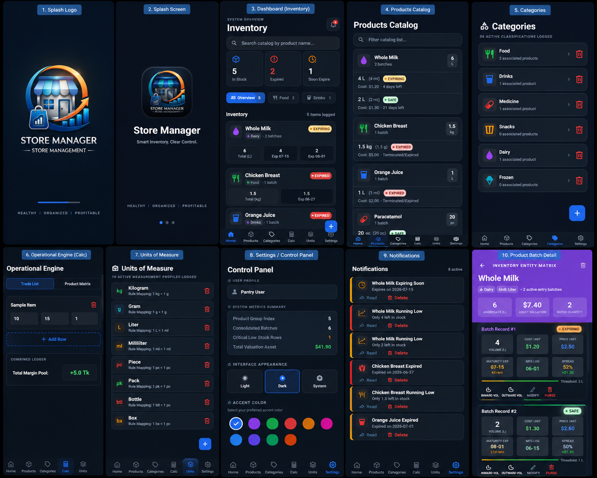

# 📦 StoreManager

  
  
  

  <h1>📦 StoreManager</h1>
  

    A modern, fast, and offline-first inventory & store management application for Android.
  

---

## 📥 Download

### 🚀 Download the Latest APK

---

## 📱 App Preview

  

  <b>🔍 Click the image above to view it in full resolution.</b>

---

## ✨ Features

- 📦 Inventory Management
- 🛒 Product Management
- 🏷️ Category Management
- 📏 Unit Management
- 📊 Profit Calculator
- 📅 Expiry Date Tracking
- 🔔 Low Stock Notifications
- 🔍 Smart Search
- 🌙 Dark & Light Theme
- 🎨 Theme Customization
- 💾 Offline Storage
- ⚡ Fast Performance
- 🔒 Privacy Friendly

---

## 📱 Requirements

- Android 8.0 (API 26) or newer
- ARM64 Architecture Recommended

---

## 📥 Installation

1. Download the latest APK.
2. Enable **Install Unknown Apps** if required.
3. Install the APK.
4. Launch **StoreManager**.

---

## 🔄 Updates

The latest version is always available from GitHub Releases.

**Latest Release**

https://github.com/PavelAhmmedHridoy077/StoreManager/releases/latest

---

## 👨‍💻 Developer

**Pavel Ahmmed Hridoy**

Junior Frontend & Mobile App Developer

GitHub:
https://github.com/PavelAhmmedHridoy077

---

## ⭐ Support

If you like **StoreManager**, consider giving this repository a ⭐ to support future development.

---

## 📄 License

Copyright © 2026 Pavel Ahmmed Hridoy.

All Rights Reserved.
